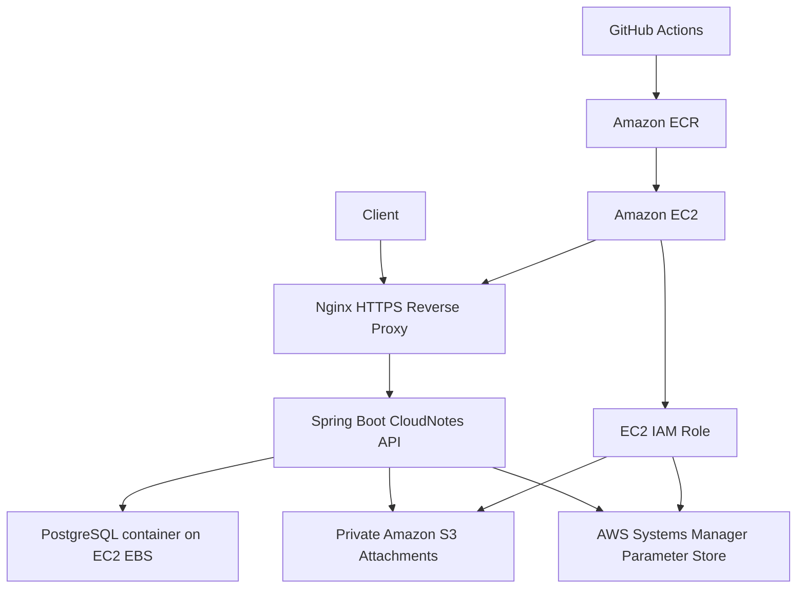
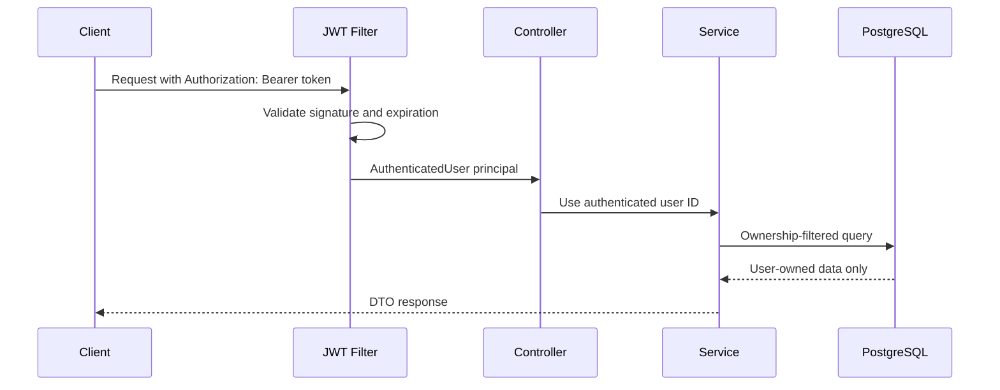

# CloudNotes


CloudNotes is a Java 21 Spring Boot REST API for secure multi-user note management with JWT authentication, PostgreSQL, private S3 attachments, Docker, CI/CD, and AWS deployment infrastructure.

## Architecture





## Key Features

- JWT registration, login, and current-user endpoint.
- Ownership-protected notes CRUD, search, favorites, tags, trash, restore, and permanent deletion.
- Private S3-backed attachments with metadata in PostgreSQL and short-lived presigned download URLs.
- Consistent JSON error model with stable error codes, field errors, and request IDs.
- Request correlation through `X-Request-ID` with MDC logging.
- Configurable CORS, security headers, rate limiting, Swagger, pagination limits, and Prometheus exposure.
- Flyway migrations with Hibernate schema validation.
- Docker local stack, production Compose/Nginx assets, Terraform AWS infrastructure, and GitHub Actions CI/CD.

## Technology Stack

| Area | Technology |
| --- | --- |
| Runtime | Java 21, Spring Boot 3 |
| API | Spring Web, Validation, Springdoc OpenAPI |
| Security | Spring Security, JWT, BCrypt |
| Data | Spring Data JPA, PostgreSQL, Flyway |
| Storage | Amazon S3 presigned URLs |
| Observability | Actuator, Micrometer, Prometheus registry |
| Quality | JUnit, MockMvc, JaCoCo, Spotless |
| Delivery | Maven, Docker, Docker Compose, GitHub Actions |
| AWS | EC2, S3, ECR, IAM, Systems Manager, Terraform, Nginx, Let's Encrypt |

## Security Design

- Password hashes are never returned.
- JWT secrets, database passwords, and AWS settings come from environment variables or production secret stores.
- Protected endpoints use the authenticated principal, not user IDs supplied by clients.
- Private resources return 404 when missing or owned by another user.
- S3 buckets stay private; the API returns presigned URLs only after ownership checks.
- CORS denies unknown origins by default and exposes only `X-Request-ID`.
- Spring Security manages stateless sessions, CSRF is disabled for the REST API, and security headers are enabled.
- Production Swagger and Prometheus endpoints are disabled unless explicitly enabled.

## API Documentation

Local OpenAPI JSON:

```bash
curl http://localhost:8080/v3/api-docs
```

Local Swagger UI:

```bash
open http://localhost:8080/swagger-ui.html
```

Swagger is controlled by:

```bash
SWAGGER_ENABLED=true
```

Production defaults to `SWAGGER_ENABLED=false`. To use Swagger UI locally, register or log in, copy the returned JWT, click Authorize, and enter the token.

API example workflows are in [docs/api-examples.md](docs/api-examples.md). A Git-friendly Bruno collection is in [bruno/CloudNotes](bruno/CloudNotes).

## Clone And Run In Under 10 Minutes

Prerequisites:

- Java 21 or newer
- Docker with Docker Compose
- Optional: `jq` for prettier manual API testing

From a clean clone:

```bash
git clone <your-cloudnotes-repository-url>
cd CloudNotes
docker compose up -d postgres
JWT_SECRET=local-development-jwt-secret-change-me-32chars-minimum ./mvnw spring-boot:run
```

In a second terminal:

```bash
curl http://localhost:8080/actuator/health
BASE_URL=http://localhost:8080 scripts/smoke-test.sh
open http://localhost:8080/swagger-ui.html
```

This starts PostgreSQL, runs the API locally, verifies auth/notes/tags/trash/attachments metadata flows, and opens Swagger UI. Attachment upload endpoints require an S3 bucket for real object storage; tests mock storage and production uses IAM-backed S3.

## Local Development

Start PostgreSQL:

```bash
docker compose up -d postgres
```

Run the application:

```bash
DATABASE_URL=jdbc:postgresql://localhost:5432/cloudnotes \
DATABASE_USERNAME=cloudnotes \
DATABASE_PASSWORD=cloudnotes \
JWT_SECRET=replace-with-a-long-random-local-secret \
AWS_REGION=us-east-1 \
AWS_S3_BUCKET=your-private-cloudnotes-bucket \
./mvnw spring-boot:run
```

Run a full local API smoke test:

```bash
BASE_URL=http://localhost:8080 scripts/smoke-test.sh
```

Load demo notes and tags:

```bash
BASE_URL=http://localhost:8080 scripts/demo-data.sh
```

## Docker Setup

Run PostgreSQL only:

```bash
docker compose up -d postgres
```

Run the full local stack:

```bash
JWT_SECRET=replace-with-a-long-random-local-secret docker compose up --build
```

View logs:

```bash
docker compose logs -f app
docker compose logs -f postgres
```

Stop services:

```bash
docker compose down
```

Erase local PostgreSQL data intentionally:

```bash
docker compose down -v
```

## Testing And Quality

Format Java:

```bash
./mvnw spotless:apply
```

Check formatting:

```bash
./mvnw spotless:check
```

Run tests:

```bash
./mvnw test
```

Run verification with JaCoCo coverage:

```bash
./mvnw verify
```

Coverage report:

```text
target/site/jacoco/index.html
```

Build the Docker image:

```bash
docker build -t cloudnotes:local-check .
```

Validate Compose and shell scripts:

```bash
docker compose config
ECR_IMAGE_URI=example.com/cloudnotes:latest DATABASE_PASSWORD=placeholder JWT_SECRET=placeholder-placeholder-placeholder-32 AWS_REGION=us-east-1 AWS_S3_BUCKET=placeholder docker compose -f docker-compose.prod.yml config
bash -n scripts/*.sh
```

Optional local benchmark, not a production capacity claim:

```bash
k6 run scripts/k6-smoke.js
```

## Observability

Public local health:

```bash
curl http://localhost:8080/actuator/health
```

Prometheus is disabled by default. Enable it only for private or authenticated monitoring paths:

```bash
MANAGEMENT_PROMETHEUS_ENABLED=true MANAGEMENT_ENDPOINTS=health,prometheus ./mvnw spring-boot:run
```

Then authenticate before calling:

```bash
curl http://localhost:8080/actuator/prometheus \
  -H "Authorization: Bearer $TOKEN"
```

Production monitoring should scrape metrics through private networking, localhost, a monitoring security group, or an authenticated reverse proxy. Do not expose `/actuator/prometheus` publicly through Nginx.

## AWS Deployment

CloudNotes is prepared for this first production topology:

```text
Client -> HTTPS -> Nginx on EC2 -> Spring Boot container -> PostgreSQL container on EC2
                                                       -> Private S3 bucket

GitHub Actions -> Amazon ECR -> EC2 through SSM Run Command
```

Detailed deployment guidance is in [docs/aws-production-deployment.md](docs/aws-production-deployment.md). Terraform files are in [infra](infra).
The operational checklist is in [docs/deployment-checklist.md](docs/deployment-checklist.md).

Live API URL:

```text
https://YOUR_API_DOMAIN
```

Swagger URL:

```text
Local/dev only: http://localhost:8080/swagger-ui/index.html
Production: disabled by the prod profile
```

High-level order:

1. Configure AWS account, region, DNS, and GitHub OIDC.
2. Copy `infra/terraform.tfvars.example` to an untracked tfvars file and set `s3_bucket_name` and `github_repository`.
3. Run `terraform plan` and review cost before applying anything.
4. After apply, store `/cloudnotes/prod/database-password` and `/cloudnotes/prod/jwt-secret` as SSM standard `SecureString` parameters.
5. Configure GitHub repository variables and secrets.
6. Push to `main`; GitHub Actions verifies the app, pushes an image to ECR, uploads a tiny deployment bundle to S3, deploys through SSM Run Command, and checks health.

Production runtime values include:

```bash
DATABASE_URL=jdbc:postgresql://postgres:5432/cloudnotes
DATABASE_USERNAME=cloudnotes
DATABASE_PASSWORD=replace-with-secret
JWT_SECRET=replace-with-strong-secret
AWS_REGION=us-east-1
AWS_S3_BUCKET=your-private-cloudnotes-bucket
SWAGGER_ENABLED=false
CORS_ALLOWED_ORIGINS=https://app.example.com
```

Do not commit real `.env` files, Terraform state, certificates, JWTs, presigned URLs, or AWS credentials.

### Near-Free AWS Cost Target

The default Terraform path intentionally avoids NAT Gateway, RDS, ALB, and Elastic IP. Expected resources:

- One `t3.micro` EC2 instance.
- One 20 GB encrypted gp3 root EBS volume.
- One private S3 bucket.
- One private ECR repository with only the last two images retained.
- IAM roles/policies, VPC, subnet, route table, security group, Internet Gateway, and SSM usage.

Estimated monthly cost in `us-east-1`:

- New/free-tier eligible account: approximately `$0-$5/month`, usually dominated by public IPv4 hourly charges and small ECR/S3 overages.
- Non-free-tier account: approximately `$12-$15/month` for always-on `t3.micro`, public IPv4, and 20 GB EBS, plus small S3/ECR usage.

Always confirm with AWS Pricing Calculator before applying. Public IPv4 addresses are charged even when attached, and Free Tier eligibility depends on account age and usage.

### Required GitHub Configuration

Repository variables:

```text
AWS_REGION
AWS_ACCOUNT_ID
ECR_REPOSITORY
EC2_INSTANCE_ID
AWS_S3_BUCKET
APP_HEALTH_URL
DEPLOY_APP_DIR
```

Repository or environment secrets:

```text
AWS_DEPLOY_ROLE_ARN
```

Runtime app secrets are stored on AWS as standard SSM `SecureString` parameters, not in Terraform state:

```text
/cloudnotes/prod/database-password
/cloudnotes/prod/jwt-secret
```

### Cleanup

To avoid ongoing charges:

```bash
terraform -chdir=infra destroy
aws ecr delete-repository --repository-name cloudnotes --force
aws s3 rb s3://YOUR_BUCKET_NAME --force
```

Also delete any manually created Parameter Store values, DNS records, local Terraform state, EBS snapshots, and ACM/Let's Encrypt artifacts you no longer need.

## Environment Variables

| Variable | Purpose | Local default |
| --- | --- | --- |
| `DATABASE_URL` | JDBC URL for PostgreSQL | `jdbc:postgresql://localhost:5432/cloudnotes` |
| `DATABASE_USERNAME` / `DATABASE_PASSWORD` | Application database credentials | `cloudnotes` / `cloudnotes` |
| `JWT_SECRET` | HMAC signing secret, at least 32 bytes | none for Maven, local Compose placeholder |
| `JWT_EXPIRATION` | JWT lifetime | `PT1H` |
| `AWS_REGION` / `AWS_S3_BUCKET` | S3 attachment region and bucket | `us-east-1` / empty |
| `SWAGGER_ENABLED` | Enables OpenAPI and Swagger UI | `true`, prod default `false` |
| `CORS_ALLOWED_ORIGINS` | Comma-separated browser origins | empty |
| `MANAGEMENT_ENDPOINTS` | Exposed actuator endpoints | `health` |
| `MANAGEMENT_PROMETHEUS_ENABLED` | Enables Prometheus registry endpoint | `false` |
| `RATE_LIMIT_*` | Login, registration, upload, and download URL limits/windows | see `.env.example` |
| `PAGE_DEFAULT_SIZE`, `PAGE_MAX_SIZE`, `PAGE_ALLOWED_SORT_FIELDS` | Pagination safety settings | `20`, `100`, `createdAt,updatedAt,title` |
| `MAX_FILE_SIZE`, `MAX_REQUEST_SIZE`, `DOWNLOAD_URL_EXPIRATION` | Upload and presigned URL limits | `10MB`, `10MB`, `PT5M` |
| `DB_POOL_*`, `DB_*_TIMEOUT_MS` | Production Hikari pool tuning | see `.env.production.example` |
| `ECR_IMAGE_URI`, `APP_DOMAIN`, `LETSENCRYPT_EMAIL` | Production deployment and TLS scripts | no default |

## CI/CD

The CI workflow runs:

- Spotless formatting check
- Maven verification with tests and JaCoCo coverage
- Shell script syntax checks
- Terraform formatting check
- Executable JAR build
- Docker image build
- Docker Compose configuration validation
- Compose startup and health check

The deploy workflow runs on pushes to `main` or through manual dispatch. It uses GitHub OIDC to assume an AWS role, pushes a SHA-tagged image to ECR, uploads the deployment bundle to S3, deploys to EC2 through Systems Manager Run Command, and checks the public health endpoint.

Deployment badges use the configured GitHub repository:

```markdown


```

## Project Structure

```text
src/main/java/com/cloudnotes
  config/        Spring, storage, OpenAPI, pagination, CORS, rate-limit config
  controller/    REST controllers
  domain/        JPA entities
  dto/           Request and response DTOs
  exception/     Error model and global exception handling
  repository/    Ownership-safe Spring Data repositories
  security/      JWT filter, principal, authentication entry point
  service/       Auth, notes, tags, attachments, metrics, rate limits
  storage/       S3 storage adapter
  web/           Request ID and client address helpers
src/main/resources/db/migration/ Flyway migrations
docs/                         Deployment, API examples, decisions
bruno/CloudNotes              API client collection
infra/                        Terraform AWS infrastructure
deploy/nginx                  Nginx configs and templates
scripts/                      Smoke, demo, deployment, certificate scripts
```

## Engineering Decisions

The full decision record is in [docs/engineering-decisions.md](docs/engineering-decisions.md). Highlights:

- Current `/api` routes are documented as version 1 instead of adding duplicate `/api/v1` aliases prematurely.
- Rate limiting is in-memory and per instance; multi-instance deployments should use Redis, WAF, or gateway-backed limits.
- Optimistic locking is deferred until clients can send and handle version conflicts.
- HSTS belongs in the HTTPS production proxy, not local HTTP development.
- No license is selected yet; add one only after intentionally choosing reuse terms.

## Screenshots And Demo Assets

Do not fabricate screenshots. Recommended portfolio captures:

- Swagger UI with the CloudNotes OpenAPI tags
- `/actuator/health`
- Successful registration response with token redacted
- `/api/users/me` as a protected endpoint
- Note creation and search results
- Attachment upload metadata and redacted download URL response
- GitHub Actions CI success
- AWS architecture or Terraform plan summary with account details redacted

Store future images under `docs/images/`.

## Portfolio Presentation

GitHub description:

```text
Production-oriented Java 21 Spring Boot REST API for secure multi-user notes: JWT auth, PostgreSQL/Flyway, notes/tags/search/trash, private S3 attachments, Swagger, Docker, Terraform AWS infrastructure, CI/CD, observability, and smoke tests.
```

One-minute demo script:

```text
CloudNotes is a production-oriented Spring Boot backend for secure note management. Requests enter through Nginx, reach a stateless Spring Boot API, and persist data in PostgreSQL with Flyway-managed migrations. Authentication uses JWTs and BCrypt, and every notes, tags, trash, restore, delete, and attachment operation is scoped to the authenticated user. Attachments stay private in S3; the API stores metadata and returns short-lived presigned download URLs only after ownership checks. The project includes Swagger/OpenAPI, consistent JSON errors with request IDs, rate limiting, Prometheus-ready metrics, Docker Compose for local runs, low-cost Terraform for AWS EC2/S3/ECR/IAM/SSM, and GitHub Actions that verify and deploy the API.
```

## Resume-Ready Summary

CloudNotes is a production-oriented Spring Boot backend demonstrating secure multi-tenant API design, ownership-aware data access, AWS storage/deployment patterns, automated testing, observability, and CI/CD.

Resume bullets:

- Built a secure Java 21 Spring Boot REST API with JWT authentication, BCrypt password hashing, ownership-filtered repositories, consistent error responses, request correlation IDs, and tests for auth/security boundaries.
- Implemented PostgreSQL/Flyway persistence, note search/tags/favorites/soft deletion, private S3 attachments with presigned URLs, Dockerized local development, and low-cost Terraform AWS infrastructure for EC2, S3, ECR, IAM, and SSM.
- Added GitHub Actions CI/CD with formatting checks, Maven tests, JaCoCo coverage, Docker builds, deployment via OIDC and SSM, configurable Prometheus metrics, rate limiting, and smoke/demo automation.

## Final Project Checklist

✅ Completed:

- Registration, login, JWT authentication, and current-user endpoint
- Notes CRUD, search, favorites, tags, trash, restore, and permanent deletion
- Private S3 attachment metadata, uploads, downloads, deletes, and ownership checks
- Swagger/OpenAPI, consistent errors, request IDs, rate limiting, and production-safe actuator defaults
- Flyway migrations, Hibernate validation, Docker, production Compose, Nginx templates, Terraform, CI/CD, smoke scripts, demo data, and Bruno collection

⚠ Needs manual AWS setup:

- AWS account, DNS domain, Route 53 or external DNS record, production AMI selection, and cost review
- Terraform variables, `terraform plan`, reviewed `terraform apply`, SSM Parameter Store values, and GitHub Actions repository variables/secrets
- EC2 bootstrap, TLS certificate request, real S3 bucket name, real CORS origin, and first production deploy

❌ Missing:

- No frontend client
- No refresh tokens, email verification, password reset, virus scanning, or distributed rate limiting
- No selected license file yet

## Future Improvements

- Refresh tokens and token rotation.
- Email verification and password reset.
- Frontend client.
- Redis-backed distributed rate limiting.
- Antivirus scanning for uploaded files.
- Optimistic locking once clients support version conflict handling.
- Multi-instance or container-orchestrated deployment for high availability.
