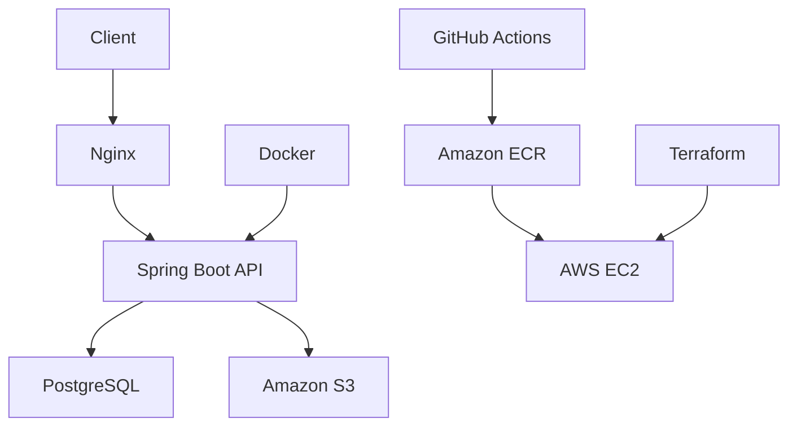

# CloudNotes

CloudNotes is a production-oriented Java 21 Spring Boot REST API for secure multi-user note management. It demonstrates practical backend engineering with JWT security, ownership-safe data access, PostgreSQL/Flyway persistence, private S3 attachments, Docker, CI/CD, and Terraform-based AWS deployment.

## Features

- JWT Authentication & Authorization with BCrypt password hashing.
- RESTful CRUD API for notes, search, favorites, tags, trash, restore, and permanent delete.
- PostgreSQL persistence with Flyway migrations and Hibernate schema validation.
- Docker support for local development and production Compose.
- GitHub Actions CI with Maven verification, tests, coverage, formatting, Docker, and Compose checks.
- Terraform infrastructure for AWS EC2, S3, ECR, IAM, Systems Manager, and GitHub OIDC.
- AWS deployment through ECR, SSM Run Command, Nginx, and production health checks.
- Production-ready configuration for CORS, security headers, rate limits, Swagger, Actuator, and externalized secrets.

## Architecture



## Tech Stack

| Area | Technology |
| --- | --- |
| Runtime | Java 21, Spring Boot 3 |
| API | Spring Web, Validation, Springdoc OpenAPI |
| Security | Spring Security, JWT, BCrypt |
| Data | PostgreSQL, Spring Data JPA, Flyway |
| Storage | Amazon S3 presigned URLs |
| Delivery | Maven, Docker, Docker Compose, GitHub Actions |
| Cloud | Terraform, EC2, ECR, S3, IAM, SSM, Nginx |

## Quick Start

Prerequisites:

- Java 21+
- Docker and Docker Compose

Run locally:

```bash
git clone https://github.com/syzackerman/cloudnotes.git
cd cloudnotes
docker compose up -d postgres
JWT_SECRET=local-development-jwt-secret-change-me-32chars-minimum ./mvnw spring-boot:run
```

Verify:

```bash
curl http://localhost:8080/actuator/health
open http://localhost:8080/swagger-ui.html
```

Run the smoke test:

```bash
BASE_URL=http://localhost:8080 scripts/smoke-test.sh
```

## API Overview

| Method | Endpoint | Description |
| --- | --- | --- |
| `POST` | `/api/auth/register` | Register and receive a JWT |
| `POST` | `/api/auth/login` | Log in and receive a JWT |
| `GET` | `/api/users/me` | Return the authenticated user |
| `POST` | `/api/notes` | Create a note |
| `GET` | `/api/notes` | List, search, filter, sort, and paginate notes |
| `GET` | `/api/notes/{id}` | Get one owned note |
| `PUT` | `/api/notes/{id}` | Update one owned note |
| `DELETE` | `/api/notes/{id}` | Move one owned note to trash |
| `POST` | `/api/notes/{id}/restore` | Restore a trashed note |
| `DELETE` | `/api/notes/{id}/permanent` | Permanently delete a note |
| `POST` | `/api/notes/{id}/attachments` | Upload an attachment |

Swagger is enabled locally and disabled by default in production:

```text
http://localhost:8080/swagger-ui.html
```

## Security Highlights

- Password hashes are never returned.
- JWT claims are validated on protected requests.
- User ownership is enforced in service/repository queries.
- Cross-user access returns `404`, not `403`.
- Runtime secrets are supplied through environment variables or AWS SSM Parameter Store.
- Private S3 objects are accessed through short-lived presigned URLs.

## Testing

```bash
./mvnw test
./mvnw verify
```

Additional checks:

```bash
./mvnw spotless:check
docker compose config
docker build -t cloudnotes:local-check .
```

## Deployment

The default AWS path is designed for a low-cost portfolio deployment:

- One `t3.micro` EC2 instance.
- Dockerized Spring Boot, PostgreSQL, and Nginx.
- Private S3 bucket for attachments and deployment bundles.
- ECR image repository.
- GitHub Actions OIDC role with least-privilege deploy permissions.
- Runtime secrets in SSM Parameter Store.

Terraform intentionally avoids NAT Gateway, RDS, ALB, Elastic IP, and SSH ingress by default.

```bash
cd infra
cp terraform.tfvars.example terraform.tfvars
terraform init
terraform fmt -check -recursive
terraform validate
terraform plan
```

Do not run `terraform apply` until the plan and monthly cost are reviewed. Detailed AWS steps are in [docs/aws-production-deployment.md](docs/aws-production-deployment.md), with an operational checklist in [docs/deployment-checklist.md](docs/deployment-checklist.md).

## Configuration

Key environment variables:

| Variable | Purpose |
| --- | --- |
| `DATABASE_URL` | PostgreSQL JDBC URL |
| `DATABASE_USERNAME` / `DATABASE_PASSWORD` | Database credentials |
| `JWT_SECRET` / `JWT_EXPIRATION` | JWT signing secret and lifetime |
| `AWS_REGION` / `AWS_S3_BUCKET` | S3 attachment storage |
| `SWAGGER_ENABLED` | OpenAPI and Swagger UI toggle |
| `CORS_ALLOWED_ORIGINS` | Browser origins allowed in production |
| `RATE_LIMIT_*` | Login, registration, upload, and download URL limits |

See [.env.example](.env.example) and [.env.production.example](.env.production.example) for the full list.

## Project Structure

```text
src/main/java/com/cloudnotes
  config/        Spring, storage, OpenAPI, pagination, CORS, rate-limit config
  controller/    REST controllers
  domain/        JPA entities
  dto/           Request and response DTOs
  exception/     Error model and global exception handling
  repository/    Ownership-safe Spring Data repositories
  security/      JWT filter, principal, authentication entry point
  service/       Auth, notes, tags, attachments, metrics, rate limits
  storage/       S3 storage adapter
infra/           Terraform AWS infrastructure
deploy/nginx     Production Nginx templates
scripts/         Smoke, demo, deployment, and certificate scripts
```
